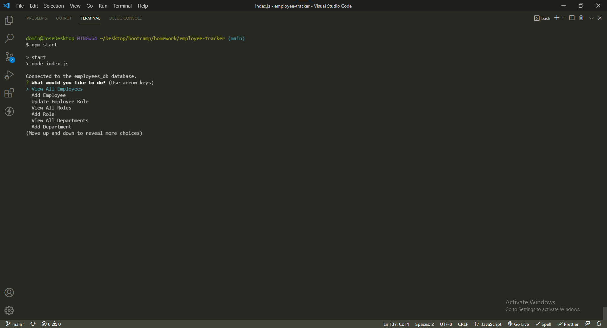
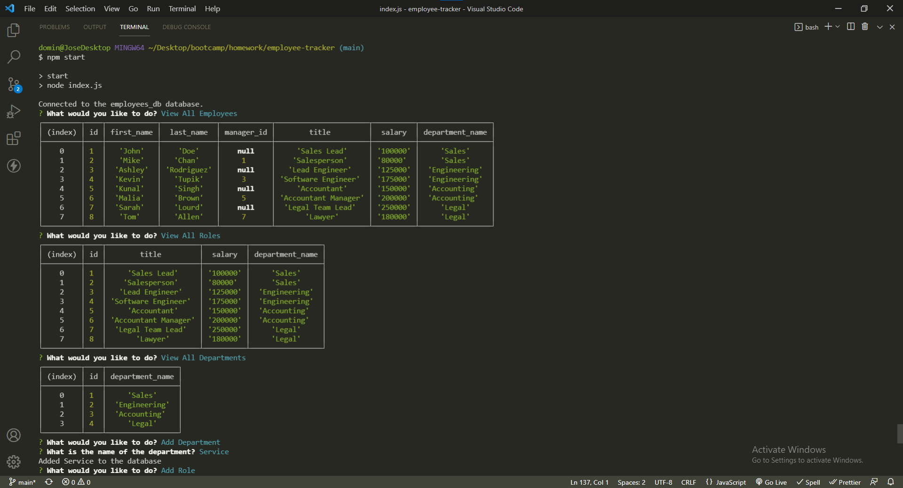
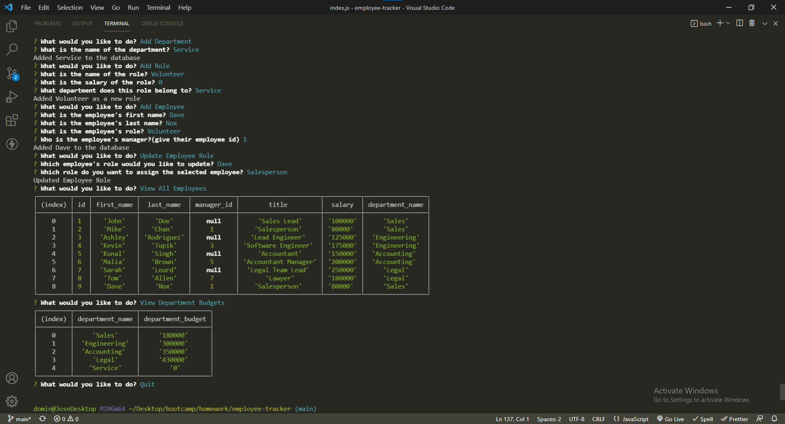

# Employee Tracker
## Description
- The motivation for this project was to to build a command-line application that manages a company's employee database, using Node.js, Inquirer, and MySQL.
- This project has helped me to gain an understanding of how to use MySQL to make a database and tables, and then use Node.js and Inquirer to view those tables and also dynamically add, remove, or view the data that I want.
## Table of Contents
- [Installation](#installation)
- [Usage](#usage)
- [Credits](#credits)
- [License](#license)
- [Badges](#badges)
- [Tests](#tests)
## Installation
- Install the required dependencies by running ```npm install``` and then ```npm start``` to begin the prompts.
- Required dependencies include: inquirer, console.table, and mysql2
## Usage
- Github Repo: https://github.com/jdomindev/employee-tracker
- Screenshots:
    
    
    
- Video:
    - [Demo-video](https://drive.google.com/file/d/1m9ZUuesM-TskxpG_YnLNi858p7koRE6W/view?usp=sharing)
    
## Credits
- N/A
## License
MIT License

Copyright (c) 2022 Jose Dominguez

Permission is hereby granted, free of charge, to any person obtaining a copy of this software and associated documentation files (the "Software"), to deal in the Software without restriction, including without limitation the rights to use, copy, modify, merge, publish, distribute, sublicense, and/or sell copies of the Software, and to permit persons to whom the Software is furnished to do so, subject to the following conditions:

The above copyright notice and this permission notice shall be included in all copies or substantial portions of the Software.

THE SOFTWARE IS PROVIDED "AS IS", WITHOUT WARRANTY OF ANY KIND, EXPRESS OR IMPLIED, INCLUDING BUT NOT LIMITED TO THE WARRANTIES OF MERCHANTABILITY, FITNESS FOR A PARTICULAR PURPOSE AND NONINFRINGEMENT. IN NO EVENT SHALL THE AUTHORS OR COPYRIGHT HOLDERS BE LIABLE FOR ANY CLAIM, DAMAGES OR OTHER LIABILITY, WHETHER IN AN ACTION OF CONTRACT, TORT OR OTHERWISE, ARISING FROM, OUT OF OR IN CONNECTION WITH THE SOFTWARE OR THE USE OR OTHER DEALINGS IN THE SOFTWARE.
## Badges


[](https://opensource.org/licenses/MIT)
## Tests
- N/A